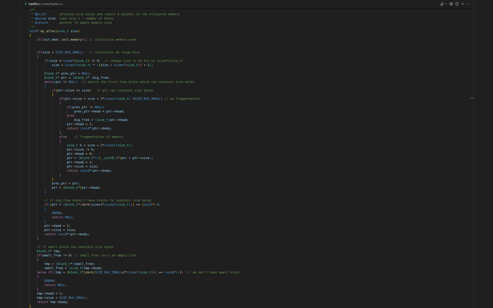
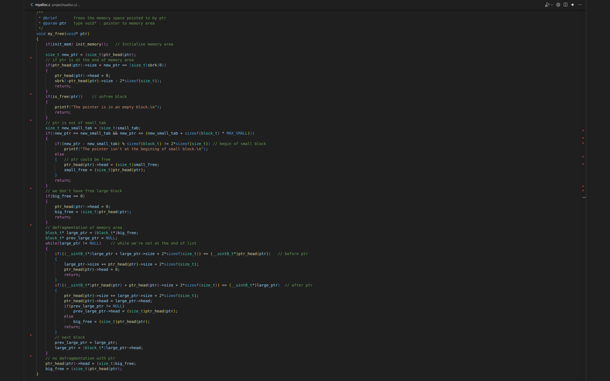
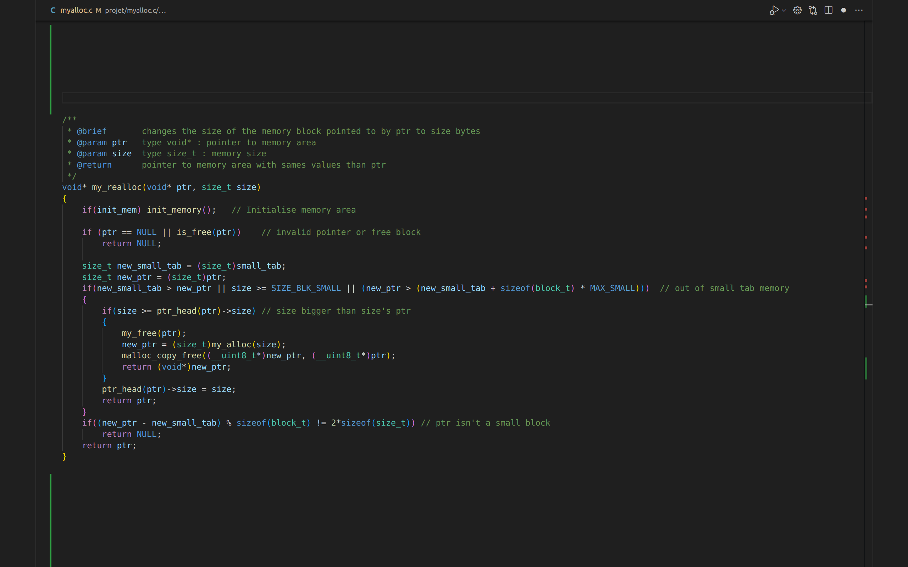

# Allocateur de mémoire en C
L'objectif de ce projet était de tester et de développer nos compétences en C et dans l'idée que l'on se fesait de la représentation de la mémoire au sein de l'ordinateur. (Sans être rentré en détail dans le principe de mémoire virtuelle.)

## my_alloc
my_alloc est la première fonction que nous avons codée. Elle est le substitue de la fonction malloc dans la bibliothèque standard C.
Son rôle est donc de pouvoir allouer de la mémoire. Notre fonction sépart deux catégories. Les petites zones < SIZE_BLK_SMALL et les grands > SIZE_BLK_SMALL.

## my_free
my_free est la deuxième fonction la plus importante car elle permet de remplacer free de la bibliothèque standard.
Elle permet de régler des problèmes comme la fragmentation de la mémoire.

## my_realloc
Comme dernière fonction on c'est penché sur la fonction realloc. Elle fut interressente à developpé car elle dépendait des deux autres pour un fonctionnement optimal.
on aurait put faire une fonction calloc mais elle aurait apporté moins de complexité au projet.
